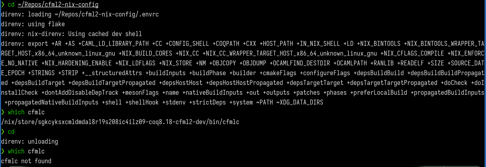

# CFML2 Nix Config

Welcome to the CFML2 Nix Config repository! This repository provides a Nix flake template designed to simplify and streamline the setup of a development environment for using [CFML2](https://gitlab.inria.fr/charguer/cfml2). 

## What this provides 

A development environment featuring:
  - cfml2 (available as a Coq library)
  - cfmlc (availavle as an executable)
  - [TLC](https://www.chargueraud.org/softs/tlc/)
  - Coq 8.18
  - OCaml 4.14.1

## Features 

- **Declarative**: Configuration is managed using [Nix](https://nixos.org/), allowing you to define your environment and dependencies in a clear, maintainable manner.
- **Isolated**: [Nix flakes](https://nixos.wiki/wiki/Flakes) provide an isolated environment, ensuring that all dependencies and tools are consistently available and do not interfere with other projects or system-wide settings.
- **Customizable**: Easily adapt the environment to suit your specific needs and preferences.
- **Seamless Integration**: Uses [direnv](https://direnv.net/) to automatically load environment settings when you enter the project directory, simplifying setup and workflow.
  
## Why Nix and Nix Flakes? 

Nix is a powerful package manager and build system that enables declarative configuration. 
Nix Flakes is a feature of Nix which allow users to declare and lock dependencies in a way that composes nicely with other flakes. 
  
## Getting started 

### Install Nix and enable Nix Flakes

Nix Installation: https://nixos.org/download/

Enable Nix Flakes: https://nixos.wiki/wiki/Flakes

### Option 1. Without direnv 

#### First time setup

1. Clone this repository and navigate to the directory.
2. Run the following command to install all dependencies:
```
nix develop
```
This initial setup may take some time as it installs all required dependencies.

#### It's Done!

From this point on, each time you run `nix develop` in this directory, it will provide you with a bash development environment with all the dependencies.

### Option 2. With direnv 

#### Install direnv 

https://direnv.net/docs/installation.html

#### First time setup

1. Clone this repository and navigate to the directory.
2. Run the following command to allow automatically loading the environment settings:
```
direnv allow .
```
This initial setup may take some time as it installs all required dependencies.

#### It's Done!

From this point on, each time you enter the project directory, the environment settings will be automatically loaded.




